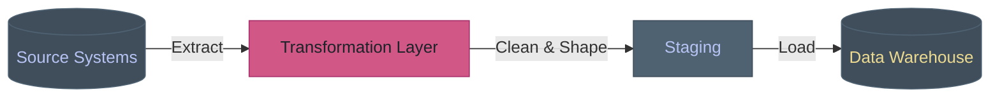
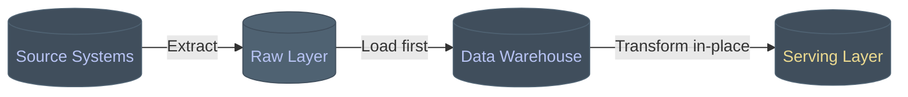
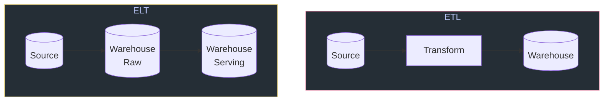
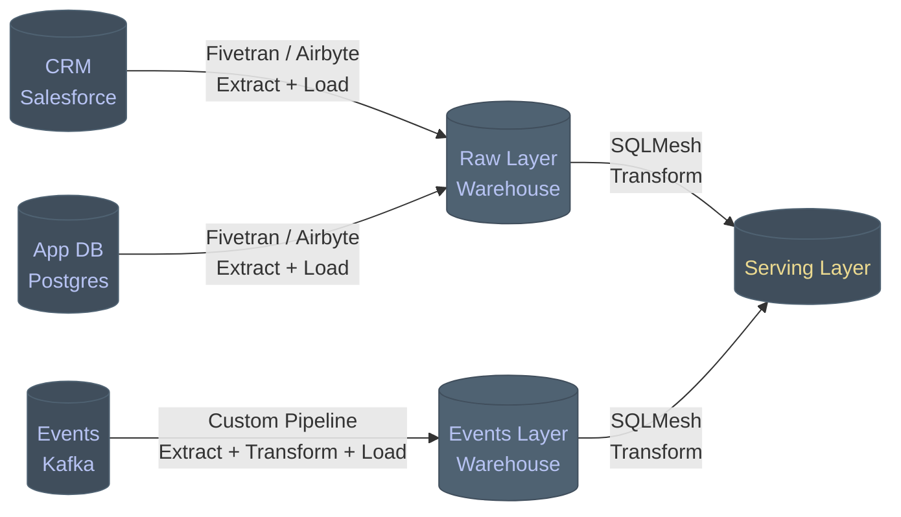

ETL and ELT are two of those terms that get used interchangeably in job descriptions and architecture documents, as if the letter order doesn't matter. It does. They represent genuinely different approaches to moving and transforming data, and picking the wrong one for your situation creates problems that compound over time.

This post is a practical breakdown of what each actually means, where each makes sense, and how to think about the decision.

<!-- truncate -->

## What They Are

The acronyms describe the order of operations.

**ETL — Extract, Transform, Load** means you pull data from the source, transform it before it enters your destination, and then load the clean result. The heavy work happens outside the warehouse.

**ELT — Extract, Load, Transform** means you pull the data, land it in your destination as-is, and then transform it there using the warehouse's own compute. The heavy work happens inside the warehouse.

Same three steps. Different order for the T. That difference has significant implications for where your compute lives, how much raw data you store, how quickly you can iterate, and what skills your team needs.

## ETL — The Traditional Approach



The transformation happens in a dedicated layer — historically a separate ETL server or service — before anything touches the warehouse. You decide what the data looks like before it lands.

A simple Python example of this pattern:

```python
import pandas as pd
from sqlalchemy import create_engine

def extract(source_conn: str, query: str) -> pd.DataFrame:
    engine = create_engine(source_conn)
    return pd.read_sql(query, engine)

def transform(df: pd.DataFrame) -> pd.DataFrame:
    # Normalise before it ever touches the warehouse
    df.columns = df.columns.str.lower().str.replace(" ", "_")
    df = df.dropna(subset=["customer_id", "order_date"])
    df["order_date"] = pd.to_datetime(df["order_date"])
    df["revenue"] = df["quantity"] * df["unit_price"]
    df = df[df["revenue"] > 0]
    return df

def load(df: pd.DataFrame, dest_conn: str, table: str) -> None:
    engine = create_engine(dest_conn)
    df.to_sql(table, engine, if_exists="append", index=False)

# The pipeline
raw = extract(SOURCE_CONN, "SELECT * FROM orders WHERE date = CURRENT_DATE")
clean = transform(raw)
load(clean, WAREHOUSE_CONN, "fact_orders")
```

The warehouse only ever sees clean, shaped data. It never knows what the raw source looked like.

## ELT — The Modern Approach



The data lands raw. Transformation happens inside the warehouse using SQL, typically managed by a tool like SQLMesh. The raw layer is preserved — you can always go back to it.

The same pipeline in an ELT model looks very different. The extract and load step is thin:

```python
import pandas as pd
from sqlalchemy import create_engine

def extract_and_load(source_conn: str, dest_conn: str, table: str) -> None:
    # No transformation — just move the data
    source = create_engine(source_conn)
    dest = create_engine(dest_conn)

    df = pd.read_sql(f"SELECT * FROM {table} WHERE date = CURRENT_DATE", source)
    df.to_sql(f"raw_{table}", dest, if_exists="append", index=False)

extract_and_load(SOURCE_CONN, WAREHOUSE_CONN, "orders")
```

And the transformation is handled in SQL, inside the warehouse:

```sql
-- SQLMesh model: models/marts/fact_orders.sql
MODEL (
    name marts.fact_orders,
    kind FULL,
    cron '@daily',
    grain customer_id
);

select
    customer_id,
    cast(order_date as date)             as order_date,
    quantity,
    unit_price,
    quantity * unit_price                as revenue
from raw.orders
where customer_id is not null
  and order_date is not null
  and quantity * unit_price > 0
```

The transformation logic lives in version-controlled SQL. The raw data is untouched and queryable at any time.

## Side by Side



| | ETL | ELT |
|---|---|---|
| Where transformation happens | Outside the warehouse | Inside the warehouse |
| Raw data preserved | No — only clean data lands | Yes — raw layer is kept |
| Warehouse compute used | Minimal | Heavy |
| Iteration speed | Slower — pipeline changes required | Faster — SQL changes only |
| Handling sensitive data | Strong — PII can be stripped before landing | Requires care — raw data includes everything |
| Best tooling | Python, Spark, custom pipelines | SQLMesh, Snowflake, BigQuery, Redshift |
| Works well when warehouse is expensive | Yes | No |

## When to Use ETL

**You need to strip sensitive data before it touches the warehouse.** If PII, payment data, or anything regulated needs to be masked, hashed, or removed — do it before it lands. Cleaning sensitive data after the fact in a warehouse where it's already been stored is a harder compliance conversation than never landing it at all.

**Your source data is genuinely messy at a structural level.** If you're pulling from legacy systems with inconsistent schemas, type mismatches, or encoding issues that need fixing before the data is even parseable as SQL — a Python transformation layer handles this more gracefully than trying to wrangle it in pure SQL.

**Your warehouse compute is expensive or constrained.** ELT pushes transformation cost into the warehouse. If you're on a metered warehouse with limited credits, transforming upstream can be meaningfully cheaper.

**You're working with non-SQL transformations.** Complex ML feature engineering, NLP preprocessing, geospatial calculations — these belong in Python, not SQL. If your transformation layer needs to be code rather than queries, ETL is the natural shape.

## When to Use ELT

**Your warehouse is powerful and relatively cheap to run transforms on.** Modern cloud warehouses — Snowflake, BigQuery, Redshift, Databricks — are built for exactly this. The cost of running SQL transforms inside them is often lower than running a separate compute layer.

**You want to keep raw data for reprocessing.** Requirements change. The definition of a "clean" record changes. Analysts ask questions about data you didn't know you'd need. With ELT you can always go back to the raw layer and re-derive anything. With ETL, if you didn't keep the source, it's gone.

**Your team's primary skill is SQL.** SQLMesh has made ELT genuinely accessible to teams who think in SQL rather than Python. Models are defined in plain SQL with a `MODEL` block at the top — readable, testable, version-controlled, and with built-in support for incremental strategies and environment isolation. That's a meaningful engineering quality improvement over a pile of pandas scripts.

**You need to iterate quickly.** Changing a SQLMesh model is a SQL edit and a `sqlmesh run`. SQLMesh also understands what changed — it evaluates model dependencies and only re-runs what's affected, which makes iteration noticeably faster on larger projects. Changing an ETL transformation might mean updating code, redeploying a service, and re-running a pipeline. The feedback loop is materially shorter with ELT.

## The Architecture in Practice

A real-world data platform often uses both. The pattern I see most frequently in mature setups:



Standard SaaS sources come in via a connector tool (Fivetran, Airbyte) — that's ELT. The raw data lands, SQLMesh handles the transformation. But the events pipeline, where you need to do something custom before the data is usable, might still follow an ETL pattern.

The question isn't really ETL *or* ELT. It's knowing which shape fits each source and each use case in your platform.

## The Practical Decision

If I had to make the call quickly:

Start with **ELT** if you're building on a modern cloud warehouse, your team knows SQL well, and you don't have hard compliance requirements about what data can be stored raw. SQLMesh + a connector tool is a well-understood, maintainable stack. SQLMesh is worth the nod over alternatives here specifically because of its virtual environments and built-in change detection — it's better suited to teams who want confidence that a model change won't silently break something downstream.

Reach for **ETL** when you have a specific reason — sensitive data that can't land raw, transformations that genuinely need to happen in code, or a compute cost constraint that makes warehouse-heavy transforms prohibitive.

The worst outcome is choosing one dogmatically and contorting your architecture to fit it when the other would have been the right tool. Know what each is for, and pick accordingly.
